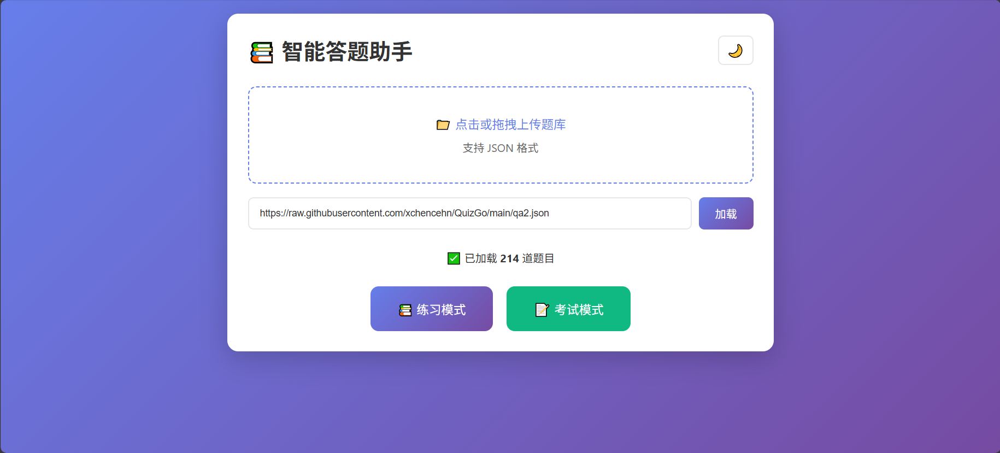

# QuizGo

QuizGo, an exam question-practice software, is a product of Vibe Coding.





Demo Preview: [https://xchencehn.github.io/QuizGo/qa2.html](https://xchencehn.github.io/QuizGo/qa2.html)


The format requirements for the JSON question bank are as follows:：
```
[

    {
      "type": "single",
      "typeName": "单选题",
      "question": "以下哪些不是小模型的优势？",
      "options": [
        "A. 资源消耗小",
        "B. 语言理解能力强",
        "C. 可在旧设备运行",
        "D. 适用场景多"
      ],
      "answer": 1,
      "analysis": "语言理解能力强是大模型的优势。"
    },

    {
      "type": "multiple",
      "typeName": "多选题",
      "question": "微调数据相比预训练数据有什么特点？",
      "options": [
        "A. 数据质量要求高",
        "B. 通常人工编写或自动构建",
        "C. 量级较小",
        "D. 可直接使用网页数据"
      ],
      "answer": [0,1,2],
      "analysis": "微调不能直接用网页原始数据（需清洗）。"
    },

    {
      "type": "judge",
      "typeName": "判断题",
      "question": "大模型的涌现能力包括语境学习、指令遵循与逐步推理能力。",
      "options": ["A. 正确","B. 错误"],
      "answer": 0,
      "analysis": "这是大模型规模达到阈值后获得的关键能力。"
    },

    {
      "type": "fill",
      "typeName": "填空题",
      "question": "Self-attention 相比普通 Attention 能关注输入序列______的依赖关系。(中文)",
      "answer": ["内部"],
      "analysis": "Self-attention 的 Q/K/V 来自同一序列，建模内部关系。"
    }
]
```
